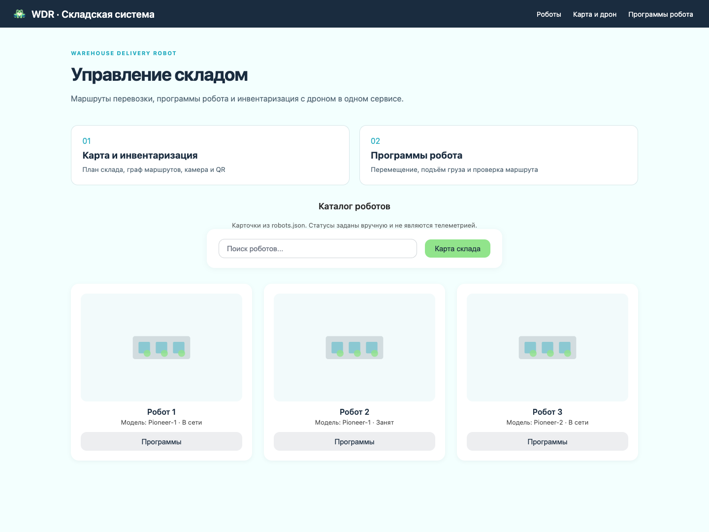
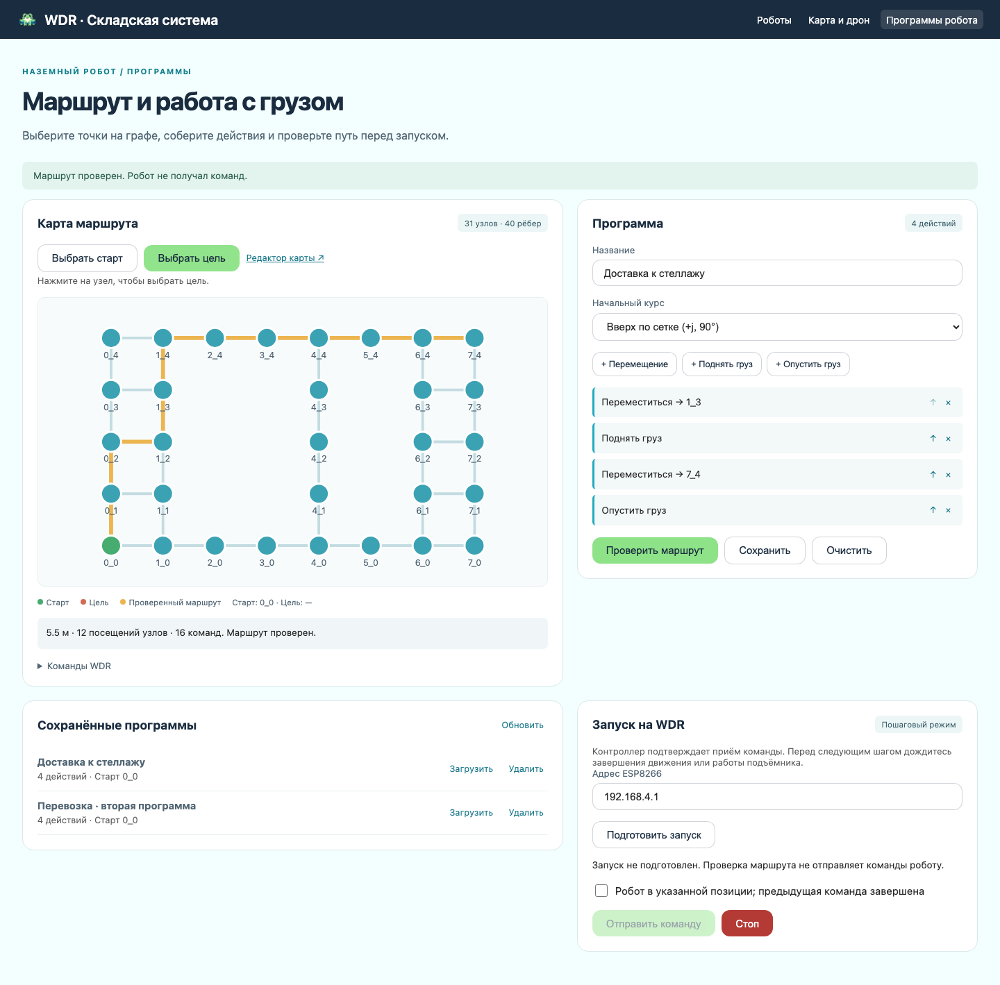
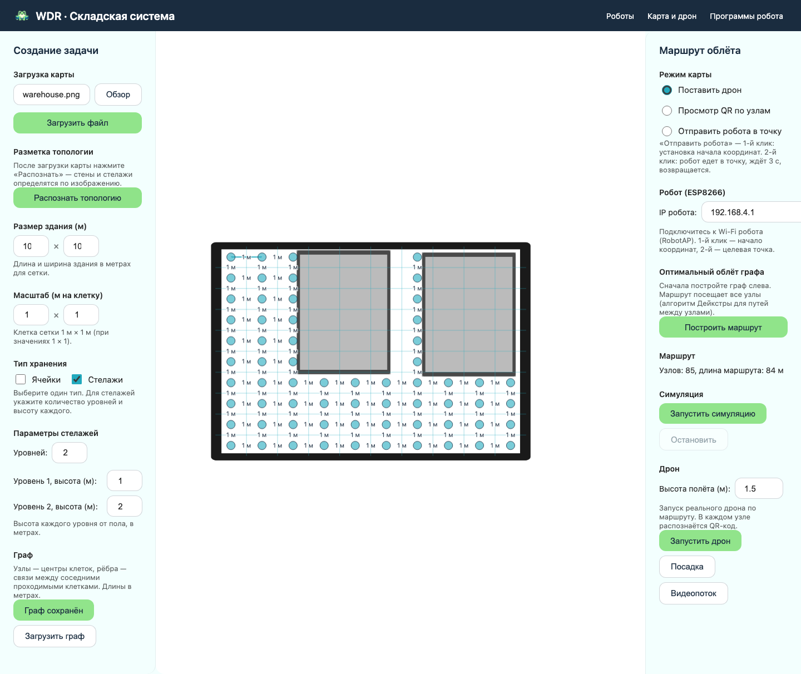
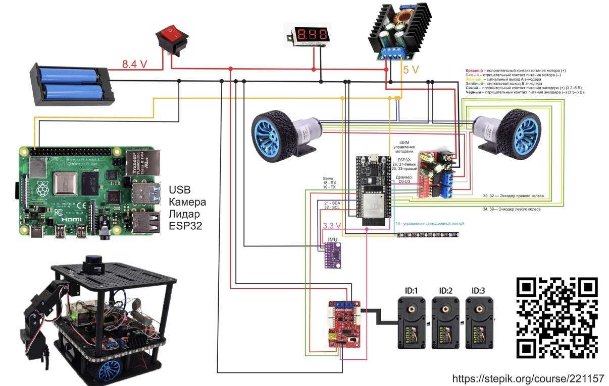

# WDR — Warehouse Delivery Robot

Система управления роботизированным складом: наземный робот перевозит грузы, дрон Geoscan Pioneer помогает проводить инвентаризацию, а веб-сервис объединяет карту склада, маршруты и программы перемещения.

**WDR — основной проект.** В него интегрирован сценарий визуального программирования: выбор точек, последовательности перемещений и работы с подъёмником, сохранение и загрузка программ.

## Интерфейс

Скриншоты работающего локального сервиса на демонстрационных данных. Каталог роботов содержит заданные вручную статусы.

### Главная страница



### Программы наземного робота



### Карта склада и инвентаризация



[Интерфейс на узком экране](docs/screenshots/programmer-mobile.png)

## Что умеет сервис

- Загружать изображение плана, находить стены и стеллажи с OpenCV.
- Строить и сохранять граф проходимых клеток с длинами рёбер в метрах.
- Рассчитывать кратчайшие пути алгоритмом Дейкстры и маршрут облёта по эвристике ближайшего соседа; показывать симуляцию облёта.
- Управлять миссией дрона через Pioneer SDK, показывать кадры камеры и сохранять QR-коды по узлам.
- Собирать программы робота из перемещений, подъёма и опускания груза; менять порядок и удалять действия.
- Сохранять несколько программ, загружать их после перезапуска и проверять на текущем графе.
- Предварительно рассчитывать путь, расстояние и повороты без отправки команд оборудованию.
- Передавать команды программе WDR пошагово, с подтверждением оператора и отдельной кнопкой STOP.

Карточки на главной странице — каталог, а не диспетчер нескольких роботов. В текущем сервисе одновременно выполняется одна программа наземного робота по указанному адресу.

## Быстрый запуск

Требуется Python 3.10 или новее. Для карты, редактора и проверки маршрутов оборудование не нужно.

```bash
git clone https://github.com/ArduRadioKot/Warehouse-delivery-robot.git
cd Warehouse-delivery-robot
python3 -m venv .venv
source .venv/bin/activate
pip install -r service/requirements.txt
python service/app.py
```

В Windows активируйте окружение командой `.venv\Scripts\activate` вместо `source`.

Откройте **[http://127.0.0.1:5002](http://127.0.0.1:5002)**. Сервер запускается локально, без отладчика. Базовые зависимости: Flask, OpenCV и NumPy; фронтенд — HTML, CSS и JavaScript без сборки и CDN.

Для работы с дроном дополнительно установите:

```bash
pip install -r service/requirements-drone.txt
```

Для декодера pyzbar нужна системная библиотека ZBar (`brew install zbar` в macOS или `sudo apt install libzbar0` в Ubuntu/Debian). При отсутствии pyzbar/ZBar модуль дрона использует доступные средства OpenCV для QR. Без Pioneer SDK запуск миссии недоступен, но веб-интерфейс работает.

## Первый сценарий

1. Откройте **Карта и дрон** и загрузите [пример плана](service/examples/warehouse.png).
2. Нажмите **Распознать топологию**, задайте реальные размеры помещения и метры на клетку. Проверьте найденные препятствия. Выберите тип хранения **Стеллажи**, чтобы исключить их клетки из графа; режим **Ячейки** строит полную сетку.
3. Нажмите **Построить граф** — граф автоматически сохранится. Для дрона здесь же можно построить маршрут облёта и запустить экранную симуляцию.
4. Перейдите в **Программы робота**. Выберите старт на графе, начальный курс и целевой узел.
5. Добавьте **Перемещение**, **Поднять груз**, следующее перемещение и **Опустить груз**.
6. Нажмите **Проверить маршрут**. На карте появится путь, под картой — его длина, в разделе «Команды WDR» — повороты и перемещения.
7. Укажите название и нажмите **Сохранить**. Программу можно загрузить из библиотеки и проверить заново после изменения карты.

Длина перемещений берётся из рёбер графа, без фиксированного масштаба 0,5 м. Начальный курс задаётся явно: 0° — +i, 90° — +j. В редакторе программ +j направлен вверх; на исходном изображении плана строки j идут вниз. Ориентируйтесь по идентификаторам узлов и выставляйте физический курс перед запуском.

### Демонстрация с готовым графом

Для отдельной демонстрации скопируйте [готовый граф](service/examples/graph.json) в новый каталог данных и запустите сервис с ним. Это позволяет сохранить рабочую карту:

```bash
mkdir -p /tmp/wdr-demo
cp service/examples/graph.json /tmp/wdr-demo/graph.json
WDR_DATA_DIR=/tmp/wdr-demo WDR_PORT=5003 python service/app.py
```

Адрес демонстрации: [http://127.0.0.1:5003](http://127.0.0.1:5003). [Пример программы](service/examples/program.json) соответствует этому графу; его можно сохранить запросом `POST /api/robot/programs` или собрать в интерфейсе.

## Подключение наземного робота

Сервис использует связку прошивок:

- [NO-ROS-ROBOT/main/main.ino](NO-ROS-ROBOT/main/main.ino) — моторы, энкодеры, подъёмник, команды UART;
- [ESP8266 robot AP](NO-ROS-ROBOT/esp8266_robot_ap/esp8266_robot_ap.ino) — мост Wi-Fi → UART.

Подключите компьютер к сети **RobotAP**. Адрес моста по умолчанию — `192.168.4.1`, пароль из исходной прошивки — `12345678`. Скорость UART — 115200 бод. Распиновку и калибровку сверяйте с выбранной платой и скетчем.

| Действие           | HTTP на ESP8266                  | Команда UART           |
| ------------------ | -------------------------------- | ---------------------- |
| Перемещение        | `GET /drive_dist?d=…`            | `DRIVE_DIST`           |
| Поворот            | `GET /turn?angle=…`              | `TURN`                 |
| Поднять / опустить | `GET /lift_up`, `GET /lift_down` | `LIFT_UP`, `LIFT_DOWN` |
| Остановка          | `GET /stop`                      | `STOP`                 |

В редакторе нажмите **Подготовить запуск**, затем подтвердите положение робота и отправьте первую команду. После каждого движения или действия подъёмника дождитесь его завершения и подтвердите следующий шаг. После последней команды отдельно подтвердите завершение программы.

**HTTP-ответ моста подтверждает передачу команды в UART, а не завершение движения.** Поэтому автоматическая отправка всей программы подряд не используется в новом редакторе. При тайм-ауте сессия блокируется до успешной передачи STOP; повторная отправка того же шага отклоняется. STOP зависит от доступности сети и самого контроллера.

Старый вызов `/api/robot/send` сохранён для совместимости: он отправляет последовательность без подтверждений завершения. Для работы через этот мост используйте новый пошаговый редактор. Методы старого контроллера `/get_position` и `/reset_position` отсутствуют в приложенной прошивке ESP8266 и требуют отдельной реализации.

## Архитектура и файлы

```text
Браузер → Flask
          ├── OpenCV → топология → граф склада
          ├── программы → Дейкстра → HTTP → ESP8266 → UART → робот WDR
          └── Pioneer SDK → дрон → камера / QR → узлы графа
```

| Путь                                                  | Назначение                                                        |
| ----------------------------------------------------- | ----------------------------------------------------------------- |
| `service/app.py`                                      | Страницы, API карты, дрона и совместимость с прежним управлением  |
| `service/programs.py`                                 | Проверка программ, расчёт маршрута, сохранение и пошаговая сессия |
| `service/robotcontroller.py`                          | Исходный HTTP-контроллер WDR                                      |
| `service/dronecontroller.py`                          | Миссии Pioneer, кадры камеры, QR                                  |
| `service/cv_topology.py`                              | Распознавание стен и стеллажей                                    |
| `service/templates`, `service/static`                 | Интерфейс, стили, скрипты и изображения                           |
| `service/examples`                                    | План, демонстрационный граф и программа                           |
| `service/tests`                                       | Проверки API, маршрутизации и браузерного сценария                |
| `ROS hardware`, `ROS_raspberry`                       | Материалы аппаратной ветки ROS; каталог Raspberry пока пуст       |
| `NO-ROS-ROBOT`                                        | Прошивки автономного контроллера и Wi-Fi-моста                    |
| `qr_version`, `ui_controller`, `motor_controller.ino` | Экспериментальные варианты контроллеров                           |
| `ROBOT.step`                                          | CAD-модель робота                                                 |

Данные по умолчанию находятся в `service/data`: `graph.json`, `robots.json`, `nodes_qr.json`. Файл `robot_programs.json` создаётся при первом сохранении; он исключён из Git. Программы и граф записываются через временный файл и атомарную замену. Повреждённая библиотека программ не перезаписывается пустым списком.

Переменные окружения: `WDR_DATA_DIR` — каталог данных, `WDR_PORT` — порт (по умолчанию 5002). Сессия пошагового запуска хранится в памяти одного процесса. После перезапуска сервиса она теряется; состояние оборудования необходимо проверить заново. Авторизация и распределённое управление несколькими процессами пока не реализованы; сервис предназначен для локального стенда.

## API программ

Все POST-запросы в таблице принимают JSON. Ошибки возвращаются в поле `error`.

| Метод и адрес                             | Результат                                                              |
| ----------------------------------------- | ---------------------------------------------------------------------- |
| `GET /api/robot/programs`                 | `{ "programs": [...] }`                                                |
| `POST /api/robot/programs`                | Сохранить `name`, `start_node`, `start_heading`, `actions`             |
| `DELETE /api/robot/programs/<id>`         | Удалить сохранённую программу                                          |
| `POST /api/robot/programs/preview`        | Рассчитать `plan`: маршрут, расстояние и команды                       |
| `POST /api/robot/execute-current-program` | Проверка программы; при `dry_run: false` — подготовка пошаговой сессии |
| `POST /api/robot/execute-program`         | То же для сохранённого `program_id`                                    |
| `GET /api/robot/program-run`              | Состояние текущей сессии                                               |
| `POST /api/robot/program-run/step`        | `run_id`, `expected_index`, `confirm_completed` — следующий шаг        |
| `POST /api/robot/stop`                    | Передать STOP и закрыть сессию при успешном ответе                     |
| `POST /api/robot/lift/up`, `/down`        | Отдельная команда подъёмника, если нет активной программы              |

У методов запуска `dry_run` по умолчанию равен `true`: команды оборудованию не отправляются. `dry_run: false` только создаёт сессию; отправка начинается с `/step`. Поле `base_url` задаёт адрес робота, по умолчанию `192.168.4.1`.

Основные API WDR сохранены: `GET/POST /api/graph`, `POST /api/analyze-topology` (multipart, поле `image`), `/api/drone/start`, `/api/drone/land`, `/api/drone/status`, `/api/drone/frame`, `/api/drone/frame-with-qr`, `/api/nodes/qr`.

## Проверки

```bash
python -m unittest discover -s service/tests -v
```

Проверяются сохранение нескольких программ, повторное открытие данных, расчёт поворотов и расстояний, недоступные пути, ошибки входных данных, сухой запуск, защита от повторного шага, блокировка после ошибок, STOP и распознавание плана. Запросы к оборудованию заменены тестовым транспортом.

Браузерный сценарий `service/tests/browser-smoke.cjs` использует Playwright и Chromium. Он **заменяет карту и очищает библиотеку программ** на тестовом сервере: запускайте его только с отдельным `WDR_DATA_DIR`, как в примере демонстрации. При доступном пакете `playwright` выполните `node service/tests/browser-smoke.cjs`; адрес задаётся через `WDR_TEST_URL`, по умолчанию `http://127.0.0.1:5003`. Скрипт проверяет интерфейс и обновляет скриншоты в `docs/screenshots`.


